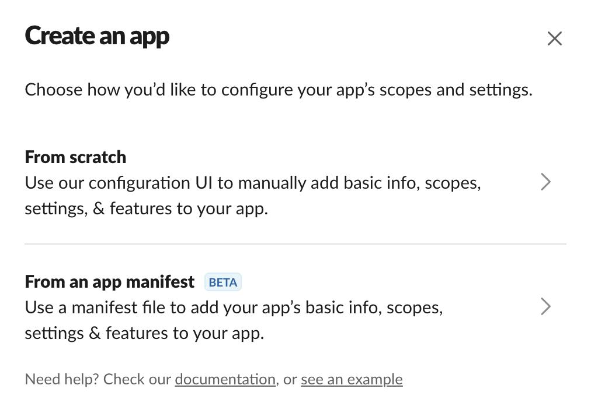
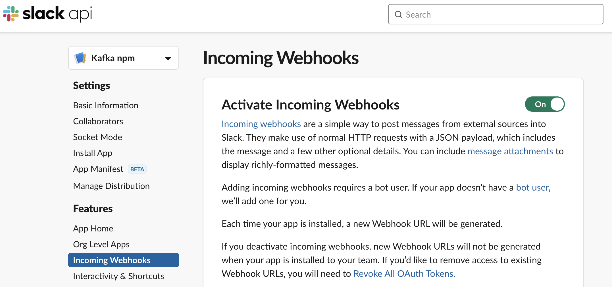
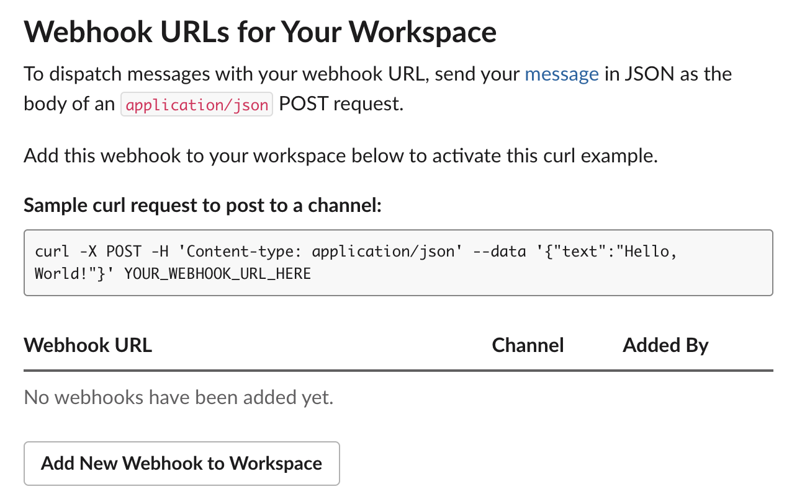

# Npm Slack Notifier

An App to receive NPM webhook events, send them to Kafka and post them to a Slack channel.

## Docker

The `docker-compose.yml` is a YAML file to configure your application's services. Then, with a single command, you can create and start all the services from your configuration: `$ docker-compose up`.

## Server

Once the services of the application are up, you can test the Kafka events:

- Docker up and running in one of the terminals
- Start the server: `yarn start:server`
- Send an event in dev mode: `yarn send:event:dev`

## Slack Webhooks

You can send messages using Incoming Webhooks in [Slack](https://api.slack.com/messaging/webhooks) with the following setup:

1. Create a Slack app 
2. Enable incoming webhooks 
3. Create an incoming webhook 

NOTE: You can access to your Slack apps [here](https://api.slack.com/apps).

## Consumer

Once the services of the application are up and the webhook URL has been added to the configuration, you can test the Slack post:

- Docker up and running in one of the terminals
- Start the server and the consumer: `yarn start`
- Send an event in dev mode: `yarn send:event:dev`
